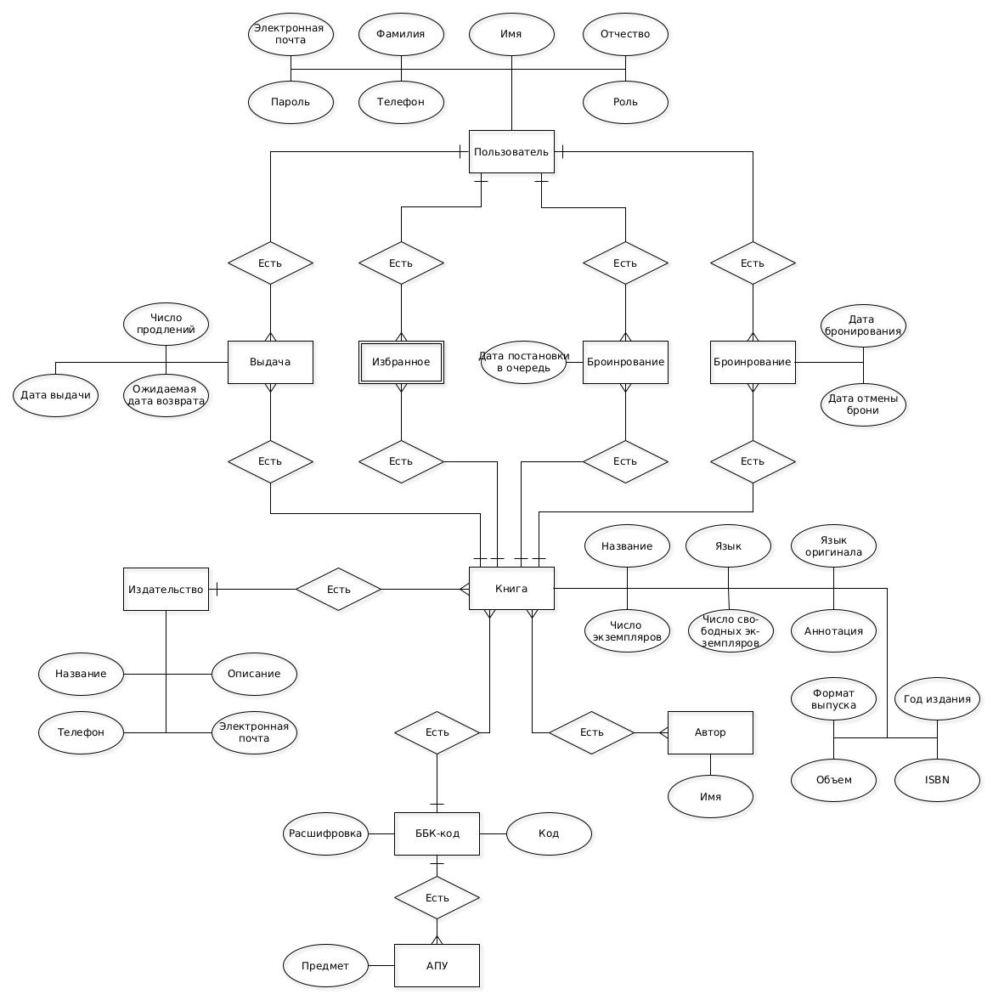

# Сервис библиотечной картотеки

---

## Описание

Сервис фиксирует выдачу и возврат книг, позволяя пользователям записываться в очередь на интересующие издания. Читатели могут просматривать доступные книги, свои текущие бронирования и историю чтения. Библиотекари управляют каталогом, отслеживают возвраты и регулируют очереди. Администраторы имеют возможность добавления новых изданий.

---

## Предметная область

Системы библиотечных картотек предназначены для управления книжными фондами, учета выданных и возвращенных экземпляров, а также автоматизации работы библиотек. Они позволяют отслеживать востребованность литературы, управлять очередями и упрощать доступ к книгам. Такие системы востребованы в общественных и университетских библиотеках, а также в корпоративных книжных архивах.

---

## Конкуренты

| Критерий                | Библиотека МГТУ                           | Литрес библиотека                           | Библиотеки Москвы                         |  
|-------------------------|-------------------------------------------|---------------------------------------------|-------------------------------------------|  
| Функциональность        | Онлайн каталог, поиск, фильтрация         | Онлайн каталог, поиск, фильтрация, подборки | Онлайн каталог, поиск, фильтрация         |  
| Целевая аудитория       | Студенты                                  | Молодежь, люди среднего возраста            | Люди всех возрастов                       |  
| Способ доступа к книгам | Бронирование и получение физической копии | Бронирование и получение элетронной версии  | Бронирование и получение физической копии |  

---

## Актуальность

Автоматизация библиотечных процессов необходима в условиях увеличения книжных фондов и цифровизации. Внедрение системы картотеки позволяет упростить выдачу книг, сократить очереди и обеспечить удобный поиск литературы, повышая доступность знаний.

---

## Роли

- Гость: авторизируется, регестрируется, выполняет поиск книг, просмотр информации о книгах;
- Пользователь: выполняет поиск книг, добавляет книги в избранное, бронирует книги, встает в очередь на книгу;
- Библиотекарь: поиск книг, просмотр информации о книгах, просмотр информации о пользователях, выдает книги, возвращает книги;
- Администратор: поиск книг, просмотр информации о книгах, добавление/изменение/удаление любой сущности.

---

## Use-case diagram

---

## ER diagram

---

## Пользовательские сценарии

- Пользователь: Авторизуется, регистрируется, выполняет поиск книг, добавляет книги в избранное, встает в очередь;
- Библиотекарь: Авторизуется, выдает книги, возвращает книги;
- Администратор: Авторизуется, добавляет публикации.

---

## BPMN

## Используемый стек
- Тип приложения: Android-приложение
- Язык программирования: Java;
- UI (Framework): Android SDK;
- Server (Framework): Java Spring;
- Unit-test (Framework): JUnit;
- СУБД: PostgreSQL;

## Верхне уровневое разбиение на компоненты

## UML-диаграмма классов

